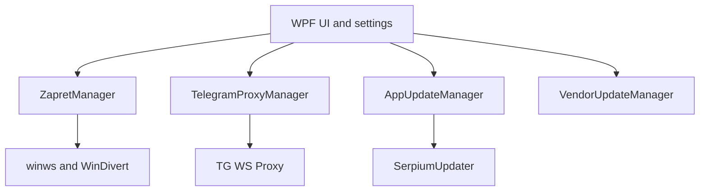

# SerpiumVPN

[](https://github.com/LegendaSeven/SerpiumVPN/releases/latest)
[](https://dotnet.microsoft.com/)
[](https://github.com/LegendaSeven/SerpiumVPN/releases/latest)
[](LICENSE)

**A Windows desktop controller for DPI-bypass strategies and local proxy profiles.**

SerpiumVPN wraps low-level networking components in a WPF application that can launch, test, rank, monitor, and replace connection strategies without asking the user to manage command-line profiles manually.

> SerpiumVPN is not a conventional full-tunnel VPN. It does not provide an encrypted tunnel for all device traffic. It controls selected DPI-bypass and local proxy tools for supported services and user-defined domains.

[Download the latest Windows release](https://github.com/LegendaSeven/SerpiumVPN/releases/latest)

<details>
<summary>Кратко на русском</summary>

SerpiumVPN — Windows-приложение для запуска и автоматического подбора DPI-bypass стратегий, пользовательских списков доменов и отдельного локального прокси для Telegram Desktop. Это не классический VPN с зашифрованным туннелем для всего трафика.

</details>

## What it does

- Starts bundled `winws`/WinDivert profiles without exposing batch-file complexity to the user.
- Tests candidate strategies against YouTube, Discord, or Cloudflare and ranks acceptable results using measured latency and transfer speed.
- Generates a fallback strategy when the bundled profiles do not pass the health check.
- Monitors the active profile and can automatically switch when connection quality drops.
- Validates and normalizes user-entered domains before updating persistent lists.
- Runs a separate local MTProto/WS proxy mode for Telegram Desktop on `127.0.0.1:1443`.
- Preserves user settings, lists, logs, and proxy data across application updates.
- Updates the application through a separate updater process and supports vendor-component refreshes.
- Provides a single-instance desktop UI, system-tray behavior, progress reporting, and diagnostic logs.

## Engineering highlights

The original SerpiumVPN code is the C#/.NET control plane: WPF UI, process orchestration, strategy selection, network health checks, state management, update flow, installer, and release automation. Packet processing and Telegram proxy transport are provided by the credited third-party projects.

| Problem | Implementation |
| --- | --- |
| Strategy orchestration | Parses supported `general*.bat` profiles, expands known variables, and starts the bundled executable directly with a controlled working directory. |
| Adaptive selection | Probes selected services, records latency and throughput, ranks candidates, reports progress, and keeps the best acceptable strategy active. |
| Runtime recovery | Periodically checks the active strategy and can cancel, stop, reselect, and persist a replacement. |
| Safe process cleanup | Finds and stops managed processes by executable path rather than killing every process with a matching name. |
| Application updates | Downloads a release manifest and archive, verifies generated release hashes, stages files, preserves user-owned data, and restarts through a standalone updater. |
| Vendor updates | Restricts archive extraction to approved runtime directories and skips user-owned lists and locked driver files. |
| Distribution | Produces self-contained Windows packages, an Inno Setup installer, an update manifest, and GitHub Release assets. |

## Architecture



## Quick start

1. Open the [latest release](https://github.com/LegendaSeven/SerpiumVPN/releases/latest).
2. Download `SerpiumVPN_Setup-<version>.exe` and install it.
3. Start SerpiumVPN. Administrator privileges are required for the packet-interception components.
4. Select the services to test and start either the default or automatic strategy.
5. Add custom domains only when needed; the editor validates entries before saving.
6. Use **Telegram WS-прогон** separately for Telegram Desktop local-proxy mode.

Current packaged builds target 64-bit Windows. Because community releases are not Authenticode-signed, Windows SmartScreen may show a warning.

## Build from source

Requirements:

- Windows
- .NET SDK 10.0.x
- Inno Setup 6 or newer only when building an installer

```powershell
git clone https://github.com/LegendaSeven/SerpiumVPN.git
cd SerpiumVPN
dotnet build SerpiumVPN.slnx -c Release
```

Create local release artifacts:

```powershell
.\release.ps1 -Version 1.0.57 -SelfContained
```

A tag matching `v*` triggers the GitHub release workflow:

```powershell
git tag v1.0.57
git push origin v1.0.57
```

## Repository map

- `MainWindow.xaml(.cs)` — main UI, user actions, state restoration, and monitoring.
- `ZapretManager.cs` — profile parsing, process control, health measurement, and automatic selection.
- `TelegramProxyManager.cs` — portable Telegram proxy configuration and lifecycle.
- `AppUpdateManager.cs` — GitHub Release lookup, download, hash verification, and updater bootstrap.
- `SerpiumUpdater/` — out-of-process staged update application.
- `VendorUpdateManager.cs` — controlled refresh of bundled third-party components.
- `bin_files/` — profiles, lists, and third-party runtime files.
- `installer/` — Inno Setup packaging.
- `.github/workflows/` — build and release automation.
- `licenses/` and `THIRD_PARTY_NOTICES.txt` — third-party license texts and attribution.

## Security and trust model

SerpiumVPN runs networking components with elevated privileges. Review the source and release contents before use.

- Generated application releases include a SHA-256 value in `update.json`; the in-app updater checks it before applying the archive.
- Vendor updates trust release assets published by the configured upstream GitHub repositories.
- Runtime extraction is restricted to expected directories and keeps user-owned configuration files.
- Current releases are not code-signed.
- Do not install local update archives from an untrusted source.

If you discover a security issue, avoid publishing exploit details in a public issue until a private reporting channel is available.

## Third-party components

SerpiumVPN uses or may distribute:

- [Flowseal/tg-ws-proxy](https://github.com/Flowseal/tg-ws-proxy)
- [Flowseal/zapret-discord-youtube](https://github.com/Flowseal/zapret-discord-youtube)
- [bol-van/zapret](https://github.com/bol-van/zapret)
- [basil00/WinDivert](https://github.com/basil00/WinDivert)

The project is not affiliated with those maintainers or with Telegram, YouTube, Discord, Google, or Cloudflare. See [THIRD_PARTY_NOTICES.txt](THIRD_PARTY_NOTICES.txt) and [licenses](licenses/) for details.

Use networking bypass tools only where permitted by applicable law, service terms, and network policy.

## License

SerpiumVPN's original source code is available under the [MIT License](LICENSE). Bundled third-party components retain their respective licenses.
